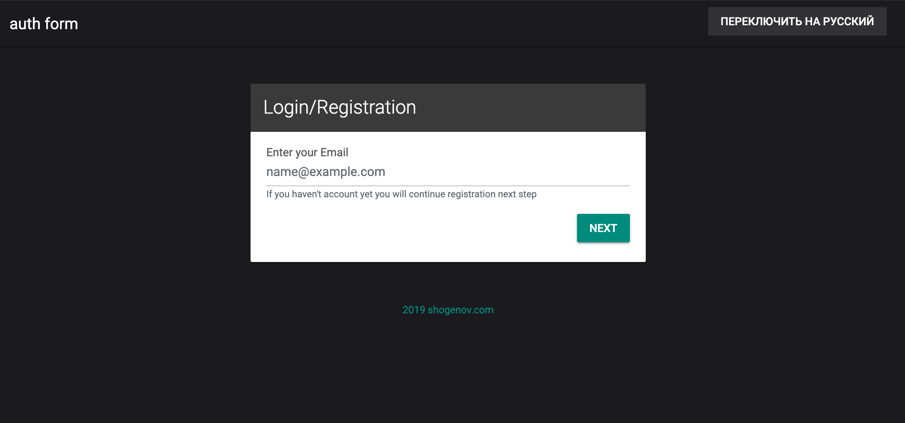

# Entrance Form

### Using 
 - php7
 - React/Redux/Sagas
 - Typescript
 - mysql
 - docker
 

# Run (with docker)

    git clone https://github.com/shaggyrec/entrance-form.git
    
    cd entrance-form
    
    docker-compose up

Open `http://localhost:4000` in your browser

## Run tests

###PHP
    docker exec -it d32961a22996 /bin/bash
    
    ./tests/run.sh
###JS
    docker exec -it d32961a22996 /bin/bash
    
    cd ../react 
    
    npm t
    
# Run local 
You need to look php/settings.json and create databases `entrance_form` and `entrance_form_test`

    cd react
    
    npm run build:prod
    
    cd ../php
    
    composer install
    
    cd composer start
    
Open `http://localhost:8080` in your browser

## Run tests

###PHP
    cd php
    
    ./tests/run.sh
###JS
    cd react
    
    npm t
